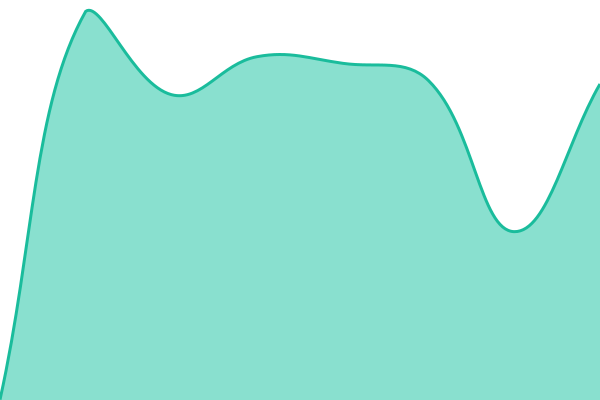
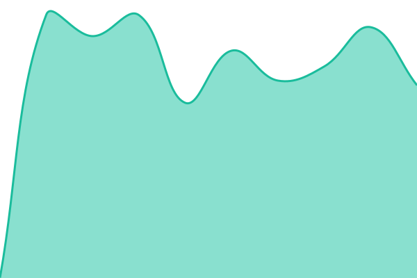

# [📈 Live Status](https://monitoring.muzeumsusch.ch): <!--live status--> **🟩 All systems operational**

This repository contains the open-source uptime monitor and status page for [my account](https://monitoring.muzeumsusch.ch), powered by [Upptime](https://github.com/upptime/upptime).

With [Upptime](https://upptime.js.org), you can get your own unlimited and free uptime monitor and status page, powered entirely by a GitHub repository. We use [Issues](https://github.com/automatixxx/muzmon/issues) as incident reports, [Actions](https://github.com/automatixxx/muzmon/actions) as uptime monitors, and [Pages](https://monitoring.muzeumsusch.ch) for the status page.

<!--start: status pages-->
<!-- This summary is generated by Upptime (https://github.com/upptime/upptime) -->
<!-- Do not edit this manually, your changes will be overwritten -->
<!-- prettier-ignore -->
| URL | Status | History | Response Time | Uptime |
| --- | ------ | ------- | ------------- | ------ |
|  [CLOUD](https://cloud.muzeumsusch.ch/status.php) | 🟩 Up | [cloud.yml](https://github.com/automatixxx/muzmon/commits/HEAD/history/cloud.yml) | 

 723ms
     
 | 

<a href="https://monitoring.muzeumsusch.ch/history/cloud">100.00%</a>
    

|  [SSO](https://sso.muzeumsusch.ch/-/health/live/) | 🟩 Up | [sso.yml](https://github.com/automatixxx/muzmon/commits/HEAD/history/sso.yml) | 

 991ms
     
 | 

<a href="https://monitoring.muzeumsusch.ch/history/sso">100.00%</a>
    

|  [Main Website](https://www.muzeumsusch.ch/en/160/SITEMAP) | 🟩 Up | [main-website.yml](https://github.com/automatixxx/muzmon/commits/HEAD/history/main-website.yml) | 

 746ms
     
 | 

<a href="https://monitoring.muzeumsusch.ch/history/main-website">96.61%</a>
    

<!--end: status pages-->

[**Visit our status website →**](https://monitoring.muzeumsusch.ch)

## 📄 License

- Powered by: [Upptime](https://github.com/upptime/upptime)
- Code: [MIT](./LICENSE) © [Anand Chowdhary](https://anandchowdhary.com)
- Data in the `./history` directory: [Open Database License](https://opendatacommons.org/licenses/odbl/1-0/)
